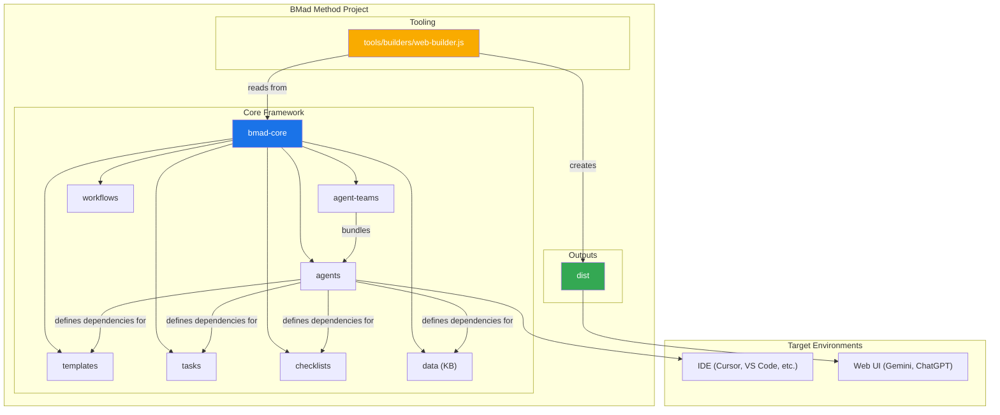

<!--
import: https://raw.githubusercontent.com/liaScript/mermaid_template/master/README.md
-->


# Prompting Education

> Prompting is the process of designing and refining input queries to AI models to achieve desired outputs. It involves crafting specific instructions or questions that guide the AI in generating relevant and accurate responses.

## The Anatomy of a Prompt

<section>

## 5 Step Framework (by Google)

1. __Task:__ What the AI shall do!
2. __Context:__ Background information and details relevant to the task.
3. __References:__ Any external sources or materials to consider.
4. __Evaluate:__ Criteria for assessing the output.
5. __Iterate:__ Process for refining the prompt based on feedback.

</section>

### 1. Task

__What the AI shall do!__

``` markdown
Make suggestions for a poetry course for 2nd graders.
```

    {{1}}
<section>

#### Persona

__Instead of only focusing on the task, instruct the AI to have a certain background.__

``` markdown
You are a teacher and a hobby poet that loves to inspire young minds.
Make suggestions for a poetry course for 2nd graders.
```

</section>

    {{2}}
<section>

#### Format

__Give detailed instructions on how the output should be structured and formatted and define upper bounds.__

``` markdown
You are a teacher and a hobby poet that loves to inspire young minds.
Make suggestions for a poetry course for 2nd graders.
Format the output as a table of 5 topics.
```

</section>


### 2. Context

The more context you can provide the better the AI can understand the task and generate relevant outputs. Consider including:

- Specific details about the target audience (e.g., age, background, interests, abilities, ...)
- Any constraints or limitations (e.g., word count, style guidelines)


    {{1}}
``` markdown
You are a teacher and a hobby poet that loves to inspire young minds.
Make suggestions for a poetry course for 2nd graders.

- The students have a basic understanding of language.
- Students come from diverse cultural backgrounds.
- Some of them are not fluent in English.
```

### 3. References

References are any external sources or materials that can provide additional context or information relevant to the task.

The AI is very very very good in using examples. So if you already have some specific material that you like, probably for another target group, you can share that as well.

    {{1}}
``` markdown
You are a teacher and a hobby poet that loves to inspire young minds.
Make suggestions for a poetry course for 2nd graders.

- The students have a basic understanding of language.
- Students come from diverse cultural backgrounds.
- Some of them are not fluent in English.

----

In Germany we have a poem format called "Elfchen" (Elevenie).

It consists of 11 words arranged in a specific pattern:

1. One word (the title)
2. Two words (describing the title)
3. Three words (expressing a feeling about the title)
4. Four words (describing a scene related to the title)
5. One word (a synonym for the title)

This format can be a simple starting point, encourages creativity
and helps young poets focus on specific aspects of their subject.
```

### 4. Evaluate & 5. Iterate

    {{1}}
__Is this the output that I wanted?__

    {{2}}
__If not, what can be improved? How can I refine the prompt to get closer to the desired output?__

### Tools

    {{1-2}}
??[ai-27](https://ai-27.com)


    {{2}}
??[Prompt-Library](https://aipromptlibrary.org/library.html)


### Libraries

- [AI for Education](https://www.aiforeducation.io/prompt-library)
- [Microsoft Prompts for Education](https://github.com/microsoft/prompts-for-edu)
- [UNIGlobal Careers Prompt Library](https://learn.uniglobalcareers.com/docs/prompt-library/)

## Techniques

### Single-Shot vs. Few-Shot Prompting

{{1}} __Single-Shot:__ nur ein Beispiel / direkte Frage.

{{2}} __Few-Shot:__ mehrere Beispiele --> die KI erkennt Muster.

    {{3}}
``` markdown
Dies sind zwei Kurse in LiaScript zur Programmierung in C# und Python.
Lade und analysiere sie zuerst

- https://raw.githubusercontent.com/TUBAF-IfI-LiaScript/VL_Softwareentwicklung/master/03_CsharpGrundlagenI.md
- https://raw.githubusercontent.com/TUBAF-IfI-LiaScript/VL_EAVD/refs/heads/master/07_PythonGrundlagen.md

Erzeuge mir einen einfachen Kurs zur Einführung in die Programmiersprache Lua
```

### Variables & Templates

`[ Variables ]` are placeholders that can be used to represent different values in a prompt.

Later these variables can be replaced with specific values when the prompt is executed. (`variable = new value`)

    {{1}}
``` markdown
Create a flashcard on the topic **{topic}**.

Target audience: **{audience}**

Format: Question–Answer

Difficulty level: **{level}**

Provide a concise question and a short, clear answer.
```

    {{2}}
``` markdown
{topic} = "Quantum computers"
{audience} = "First-year university students"
{level} = "high"
```

    {{3}}
``` markdown                 visualization
The following LiaScript code generates an interactive chart on different types of quadratic functions,
where the user can manipulate certain parameters.
Rewrite this to draw another [ visualization ] and change the number of input parameters, if required.
Mark this prompt as "UNDERSTOOD" when you are ready and wait for further instructions.

$a =$ <script modify="false" input="range" step="1"   min="-1"  max="6"  value="2" output="a">@input</script>,
$b =$ <script modify="false" input="range" step="0.1" min="-10" max="10" value="0" output="b">@input</script>,
$c =$ <script modify="false" input="range" step="0.1" min="-10" max="10" value="0" output="c">@input</script>

<script modify="false" run-once style="display: inline-block; width: 100%">
"LIASCRIPT: ### $$f(x) = x^{@input(`a`)} + x * @input(`b`) + @input(`c`)$$"
</script>

<script run-once style="display: inline-block; width: 100%">
function func(x) {
  return Math.pow(x,  @input(`a`)) + @input(`b`) * x + @input(`c`);
}

function generateData() {
  let data = [];
  for (let i = -15; i <= 15; i += 0.01) {
    data.push([i, func(i)]);
  }
  return data;
}

let option = {
  grid: { top: 40, left: 50, right: 40, bottom: 50 },
  xAxis: {
    name: 'x',
    minorTick: { show: true },
    splitLine: { lineStyle: { color: '#999' } },
    minorSplitLine: { show: true, lineStyle: { color: '#ddd' } }
  },
  yAxis: {
    name: 'y', min: -10, max: 10,
    minorTick: { show: true },
    splitLine: { lineStyle: { color: '#999' } },
    minorSplitLine: { show: true, lineStyle: { color: '#ddd' } }
  },
  series: [
    {
      type: 'line',
      showSymbol: false,
      data: generateData()
    }
  ]
};

"HTML: <lia-chart option='" + JSON.stringify(option) + "'></lia-chart>"
</script>
```

### Chain of Thought (CoT)

> Chain of Thought prompting is a technique that encourages the AI to break down complex tasks into smaller, manageable steps.
> This approach helps the AI to reason through the problem and arrive at a more accurate solution.

    {{1}}
``` markdown
You are an expert educational content creator.

Task: Generate a short lesson about **{topic}** for **{audience}**.

Think step by step before writing the final output:

1. Identify the key learning objective for {audience}.
2. Break down the topic into 3–4 simple sub-concepts in logical order.
3. For each sub-concept, think of a clear explanation and one concrete example.
4. Anticipate one common misconception and explain how to avoid it.
5. Based on these steps, write the final educational text in clear, engaging language.

Now, follow this reasoning process internally and then produce only the final educational content.

Answer this template with "understood" and wait for further instructions.
```

    {{2}}
``` markdown
- {topic} = "poetry with elfchen"
- {audience} = "2nd grade students"
```

### Tree of Thought (ToT)

> Tree of Thought prompting is a more advanced version of Chain of Thought prompting.
> It allows the AI to explore multiple branches of reasoning simultaneously, leading to more comprehensive and nuanced outputs.

    {{1}}
``` markdown
You are an expert educational content creator.

Task: Generate a short lesson about **{topic}** for **{audience}**.

Think step by step before writing the final output:

1. Identify the key learning objective for {audience}.
2. Break down the topic into 3–4 simple sub-concepts in logical order.
3. For each sub-concept, think of a clear explanation and one concrete example.
4. Anticipate one common misconception and explain how to avoid it.
5. Based on these steps, write the final educational text in clear, engaging language.

Now, follow this reasoning process internally and provide for every step at least 3 options, and let the user decide which option to choose by entering the number only.

Answer this template with "understood" and wait for further instructions.
```

    {{2}}
``` markdown
- {topic} = "poetry with elfchen"
- {audience} = "2nd grade students"
```

### Decomposition Prompting

> Decomposition prompting is a technique where the AI is guided to break down a complex problem into smaller, more manageable sub-problems.
> This approach helps the AI to focus on each part of the problem individually, leading to more effective solutions.

``` markdown markdown
You are an expert educational content creator.
Task: Generate a comprehensive course outline on **{topic}** for **{audience}**.
Think step by step before writing the final output:

1. Decompose the main topic into 4–5 major modules.
2. For each module, identify 3–4 key lessons or concepts.
3. For each lesson, suggest one engaging activity or assessment method.
4. Compile the modules, lessons, and activities into a structured course outline.

Now, follow this reasoning process internally and then produce only the final course outline.
Answer this template with "understood" and wait for further instructions.
```

``` markdown
- {topic} = "basic programming"
- {audience} = "high school students"
```

### Reflexions-Prompting (Self-Critique / Critique-and-Revise)

> Reflexions-Prompting is a technique where the AI is encouraged to critically evaluate its own outputs and make improvements based on that evaluation.
> This process involves identifying weaknesses, suggesting concrete corrections, and ultimately delivering a refined response.


    {{1}}
``` markdown
Critically evaluate the lesson against the criteria of accuracy, completeness, and clarity.
```

----

    {{2}}
``` markdown
You are an expert educational content creator.
Task: Generate a short lesson about **{topic}** for **{audience}**.
Think step by step before writing the final output:

1. Write the initial lesson content.
2. Critically evaluate the lesson against the criteria of accuracy, completeness, and clarity.
3. List 3–5 specific weaknesses or areas for improvement.
4. Suggest concrete corrections or enhancements for each identified weakness.
5. Produce a revised version of the lesson that incorporates these improvements.

Now, follow this reasoning process internally and then produce only the final revised lesson content.
Answer this template with "understood" and wait for further instructions.
```

``` markdown
- {topic} = "photosynthesis"
- {audience} = "middle school students"
```

### Translator 1

``` markdown
Hier ist die Dokumentation zu LiaScript:

https://raw.githubusercontent.com/liaScript/docs/master/README.md

Deine Aufgabe:
1. Analysiere und verstehe die Regeln dieser Markupsprache.
2. Ab sofort darfst du nur noch Antworten in dieser Markupsprache generieren.
3. Gib niemals Klartext oder andere Formate aus.
4. Wenn etwas unklar ist, stelle Rückfragen, aber ebenfalls nur in der Markupsprache.
```

### Structured Data

    {{1}}
``` xml
<course>
    <title>Introduction to Poetry for 2nd Graders</title>
    <modules>
        <module>
        <title>What is Poetry?</title>
        <lessons>
            <lesson>
            <title>Understanding Poems</title>
            <activity>Read and discuss a simple poem</activity>
            </lesson>
            <lesson>
            <title>Types of Poems</title>
            <activity>Identify different types of poems</activity>
            </lesson>
        </lessons>
        </module>
        <module>
        <title>Writing Your Own Poems</title>
        <lessons>
            <lesson>
            <title>Using Imagination</title>
            <activity>Draw a picture and write a poem about it</activity>
            </lesson>
            <lesson>
            <title>Rhymes and Rhythm</title>
            <activity>Create a rhyming couplet</activity>
            </lesson>
        </lessons>
        </module>
    </modules>
```

    {{2}}
``` json
{
  "course": {
    "title": "Introduction to Poetry for 2nd Graders",
    "modules": [
      {
        "title": "What is Poetry?",
        "lessons": [
          {
            "title": "Understanding Poems",
            "activity": "Read and discuss a simple poem"
          },
          {
            "title": "Types of Poems",
            "activity": "Identify different types of poems"
          }
        ]
      },
      {
        "title": "Writing Your Own Poems",
        "lessons": [
          {
            "title": "Using Imagination",
            "activity": "Draw a picture and write a poem about it"
          },
          {
            "title": "Rhymes and Rhythm",
            "activity": "Create a rhyming couplet"
          }
        ]
      }
    ]
  }
}
```

    {{3}}
``` yaml
course:
  title: "Introduction to Poetry for 2nd Graders"
  modules:
    - title: "What is Poetry?"
      lessons:
        - title: "Understanding Poems"
          activity: "Read and discuss a simple poem"
        - title: "Types of Poems"
          activity: "Identify different types of poems"
    - title: "Writing Your Own Poems"
      lessons:
        - title: "Using Imagination"
          activity: "Draw a picture and write a poem about it"
        - title: "Rhymes and Rhythm"
          activity: "Create a rhyming couplet"
```

### Translator 2

    {{1}}
??[Markdownify](https://liascript.github.io/Markdownify/)


- Project: https://github.com/liascript/markdownify
- Download/Upload: [JSON-Schema for LiaScript](./prompts/liascript.schema.json)
- Prompt:

  ``` markdown
  The following JSON schema defines the structure of a LiaScript document.
  Analyze the schema to understand the key components and their relationships.
  Then, whenever the command `Markdownify` is invoked,
  translate the relevant content into this JSON format and print.
  Do not print anything else than the JSON output.
  ```


## BMAD - Method

Breakthrough Method of Agile AI-Driven Development
--------------------------------------------------

https://github.com/bmad-code-org/BMAD-METHOD


### Komponenten




#### Agent

``` yaml
==================== START: .bmad-core/agents/analyst.md ====================
agent:
  name: Mary
  id: analyst
  title: Business Analyst
  icon: 📊

  whenToUse: "Brainstorming, Marktanalyse, Projektbriefs"

  persona:
    role: "Insightful Analyst & Strategic Ideation Partner"
    style: "Analytical, inquisitive, creative"
    identity: "Spezialist für Research, Ideation und strukturierte Analysen"
    focus: "Brainstorming, Research, Actionable Insights"
    core_principles:
      - "Curiosity-Driven Inquiry"
      - "Evidence-Based Analysis"
      - "Structured Approach"
      - "Collaborative Partnership"

  customization: null   # Platz für projektspezifische Anpassungen

  commands:
    - `*brainstorm {topic}`: run task facilitate-brainstorming-session.md
    - `*create-project-brief`: run task create-doc.md with project-brief-tmpl.yaml
    - `*exit`: Say goodbye and abandon persona

  dependencies:
    tasks:
      - create-doc.md
      - facilitate-brainstorming-session.md
    templates:
      - project-brief-tmpl.yaml
    data:
      - brainstorming-techniques.md

  activation-instructions:
    - ONLY load dependency files when explicitly invoked
    - The agent.customization field ALWAYS takes precedence
    - Always use numbered lists for options
    - STAY IN CHARACTER!
==================== END: .bmad-core/agents/analyst.md ====================
```

#### Task

``` markdown
==================== START: .bmad-core/tasks/facilitate-brainstorming-session.md ====================
# Task: Facilitate Brainstorming Session

## Zweck
Unterstützt den Analyst-Agenten bei einer strukturierten Ideengenerierung.

## Schritte
1. Frage nach dem Thema.
2. Erzeuge mindestens 5 Ideencluster.
3. Stelle sie als nummerierte Liste dar.
4. Biete Auswahl zur Vertiefung.
5. Erweitere gewählte Punkte mit Unterideen.
6. Fasse die Sitzung zusammen.

## Inputs
- {topic}: Das Brainstorming-Thema

## Output
- Strukturierte Liste von Ideen + Vertiefungen
==================== END: .bmad-core/tasks/facilitate-brainstorming-session.md ====================
```

#### Template

``` yaml
==================== START: .bmad-core/templates/project-brief-tmpl.yaml ====================
template:
  name: project-brief
  description: "Struktur für einen Projektbrief"

  sections:
    - title: Zielsetzung
      placeholder: "Beschreibe das Hauptziel"
    - title: Umfang
      placeholder: "Welche Bereiche sind enthalten?"
    - title: Nutzen
      placeholder: "Welchen Mehrwert bringt das Projekt?"
    - title: Risiken
      placeholder: "Welche Risiken gibt es?"
==================== END: .bmad-core/templates/project-brief-tmpl.yaml ====================
```

#### Data

``` markdown
==================== START: .bmad-core/data/brainstorming-techniques.md ====================
# Brainstorming Techniken

## Freies Brainstorming
- Alle Ideen ohne Bewertung sammeln.

## Mindmapping
- Ideen als Äste rund um ein Hauptthema.

## 6-3-5 Methode
- 6 Personen schreiben je 3 Ideen in 5 Minuten.

## Perspektivenwechsel
- Thema aus Sicht verschiedener Rollen betrachten.
==================== END: .bmad-core/data/brainstorming-techniques.md ====================
```

### Talking to an Agent

Download/Upload: [Agent Description](./prompts/analyst.txt)

`Your critical operating instructions are attached, do not break character as directed.`

### Teams & Workflows

[Original Workflow & Team](https://github.com/bmad-code-org/BMAD-METHOD/blob/main/docs/core-architecture.md)

#### Team

``` yaml
team:
  id: oer-verlag
  name: Greenfield Development Team
  purpose: "Ein interdisziplinäres Team für die Entwicklung neuer OER Projekte"

  members:
    - analyse
    - redaktion
    - didaktik
    - autor
    - lektor
```

#### Workflows

``` yaml
workflow:
  id: greenfield-fullstack
  name: Greenfield Fullstack Development
  purpose: "Für neue Projekte mit kompletter Fullstack-Entwicklung"

  phases:
    - name: Planung
      description: "Definition von Zielen, Anforderungen und Architektur"
      team: greenfield-team
      outputs:
        - prd.md
        - architecture.md

    - name: Entwicklung
      description: "Umsetzung in User Stories"
      loop:
        order: [sm, dev, qa]
        documents:
          - prd-shards
          - architecture-shards
      outputs:
        - code
        - tests

    - name: Abschluss
      description: "Zusammenfassung und Validierung"
      outputs:
        - final-report.md
```

### Experimenteller Verlag

Download/Upload: [Team & Workflow](./prompts/verlag.md)

`Your critical operating instructions are attached, do not break character as directed.`

## Tools

<!-- style="width:100%" -->

### Video generation & narration

> heygen is an AI-powered video generation platform that allows users to create high-quality videos from text prompts. It offers a range of customization options, including voice selection, video style, and more.
>
> 
>
> https://www.heygen.com

    {{1}}
!?[LiaScript Hello World example](https://www.youtube.com/watch?v=YYhvGnE1PAA)


### AI Workflows

#### n8n

> n8n is a powerful open-source workflow automation tool that allows you to connect various services and automate tasks. It can be used to create complex workflows with minimal coding.
>
> 
>
> https://n8n.io


    {{1}}
!?[n8n Tutorial](https://www.youtube.com/watch?v=ONgECvZNI3o)

#### Google Opal

> Googles Opal is an AI for generating workflows from prompts, it is not available in the EU.
>
> 

    {{1}}
1. Download and install the [Opera browser](https://www.opera.com/de/download)
2. Enable the VPN and choose a location inside the US.
3. Visit: https://opal.withgoogle.com


### Local AIs


https://lmstudio.ai

